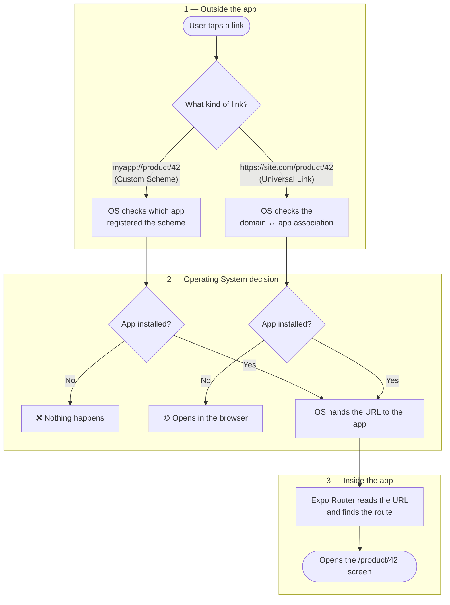
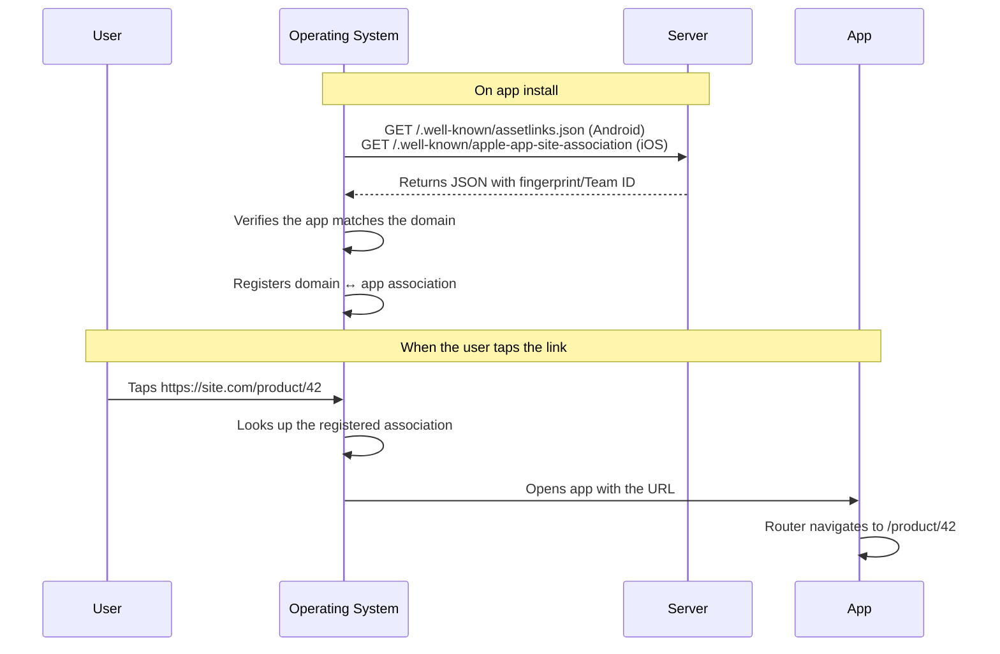
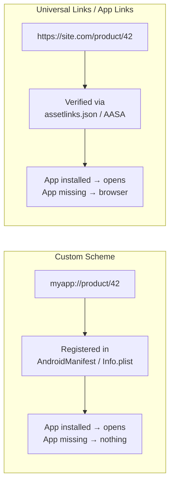
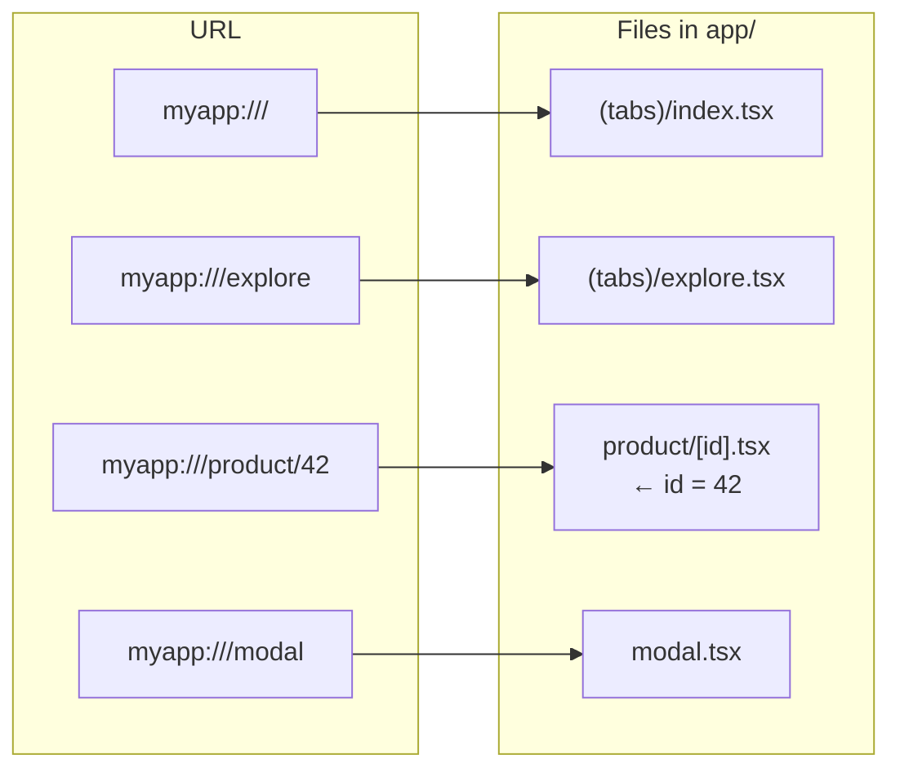

# Deep Linking 

Deep Linking is the ability to open a mobile app on a specific screen from an external URL — whether from another app, a notification, an email, an SMS, or a browser.

---

## General Architecture

Deep linking happens in **3 phases**: the link is triggered outside the app, the operating system decides what to do with it, and finally the app opens the right screen.



> **Why two different checks in phase 2?** A *custom scheme* (`myapp://`) only checks which app registered that name — which makes it fragile (any app can register it). A *universal link* (`https://`), on the other hand, requires the domain to prove it owns the app, which is why it can fall back to the browser when the app isn't installed.

---

## Verification Flow — Universal Links



---

## Custom Scheme vs Universal Links



---

## Expo Router — URL Mapping



---

## Types of Deep Link

### 1. Custom URL Scheme

```
myapp://product/42
```

- Simple to set up
- Works without owning a domain
- Doesn't open in the browser if the app isn't installed
- **Problem:** any app can register the same scheme — no exclusivity guarantee

### 2. Universal Links (iOS) / App Links (Android)

```
https://mydomain.com/product/42
```

- Uses HTTPS — exclusive to whoever controls the domain
- Opens the app if installed, otherwise falls back to the browser (automatic fallback)
- Requires a verification file hosted on the server
- More secure and recommended for production

---

## Configuration — Custom URL Scheme

### Expo (`app.json`)

```json
{
  "expo": {
    "scheme": "myapp",
    "android": {
      "intentFilters": [
        {
          "action": "VIEW",
          "data": [{ "scheme": "myapp" }],
          "category": ["BROWSABLE", "DEFAULT"]
        }
      ]
    },
    "ios": {
      "bundleIdentifier": "com.company.app"
    }
  }
}
```

The Expo Config Plugin automatically generates the native files from this configuration during the build.

### Bare React Native — Android

Edit `android/app/src/main/AndroidManifest.xml` and add an `<intent-filter>` inside the `<activity>`:

```xml
<activity android:name=".MainActivity" ...>

  <!-- existing intent-filter that launches the app -->
  <intent-filter>
    <action android:name="android.intent.action.MAIN" />
    <category android:name="android.intent.category.LAUNCHER" />
  </intent-filter>

  <!-- intent-filter for the custom scheme -->
  <intent-filter>
    <action android:name="android.intent.action.VIEW" />
    <category android:name="android.intent.category.DEFAULT" />
    <category android:name="android.intent.category.BROWSABLE" />
    <data android:scheme="myapp" />
  </intent-filter>

</activity>
```

### Bare React Native — iOS

Edit `ios/[AppName]/Info.plist` and add:

```xml
<key>CFBundleURLTypes</key>
<array>
  <dict>
    <key>CFBundleURLName</key>
    <string>com.company.app</string>
    <key>CFBundleURLSchemes</key>
    <array>
      <string>myapp</string>
    </array>
  </dict>
</array>
```

---

## Configuration — Universal Links (iOS) / App Links (Android)

### Step 1 — File on the server

**Android** — host it at `https://mydomain.com/.well-known/assetlinks.json`:

```json
[{
  "relation": ["delegate_permission/common.handle_all_urls"],
  "target": {
    "namespace": "android_app",
    "package_name": "com.company.app",
    "sha256_cert_fingerprints": ["AA:BB:CC:..."]
  }
}]
```

> The `sha256_cert_fingerprints` is obtained with:
> ```bash
> keytool -list -v -keystore release.keystore
> ```

**iOS** — host it at `https://mydomain.com/.well-known/apple-app-site-association`:

```json
{
  "applinks": {
    "apps": [],
    "details": [{
      "appID": "TEAMID.com.company.app",
      "paths": ["/product/*", "/modal"]
    }]
  }
}
```

> The file must be served with `Content-Type: application/json` and without redirects.

### Step 2 — App configuration

**Expo (`app.json`):**

```json
{
  "expo": {
    "android": {
      "intentFilters": [
        {
          "action": "VIEW",
          "autoVerify": true,
          "data": [
            {
              "scheme": "https",
              "host": "mydomain.com",
              "pathPrefix": "/product"
            }
          ],
          "category": ["BROWSABLE", "DEFAULT"]
        }
      ]
    },
    "ios": {
      "associatedDomains": ["applinks:mydomain.com"]
    }
  }
}
```

**Bare React Native — Android (`AndroidManifest.xml`):**

```xml
<intent-filter android:autoVerify="true">
  <action android:name="android.intent.action.VIEW" />
  <category android:name="android.intent.category.DEFAULT" />
  <category android:name="android.intent.category.BROWSABLE" />
  <data android:scheme="https" android:host="mydomain.com" android:pathPrefix="/product" />
</intent-filter>
```

**Bare React Native — iOS (`Entitlements.plist`):**

```xml
<key>com.apple.developer.associated-domains</key>
<array>
  <string>applinks:mydomain.com</string>
</array>
```

---

## Routing with Expo Router

With Expo Router, **there is no central routes file**. The mapping is automatic, based on the file structure:

```
app/
  _layout.tsx           → root layout
  (tabs)/
    index.tsx           → myapp:///
    explore.tsx         → myapp:///explore
  product/
    [id].tsx            → myapp:///product/:id
  modal.tsx             → myapp:///modal
```

### Dynamic parameters

```tsx
// app/product/[id].tsx
import { useLocalSearchParams } from 'expo-router';

export default function ProductScreen() {
  const { id } = useLocalSearchParams();
  return <Text>Product: {id}</Text>;
}
```

### Routing with React Navigation (without Expo Router)

```tsx
import { NavigationContainer } from '@react-navigation/native';
import * as Linking from 'expo-linking';

const linking = {
  prefixes: [Linking.createURL('/'), 'https://mydomain.com'],
  config: {
    screens: {
      Home: '',
      Product: 'product/:id',
      Modal: 'modal',
    },
  },
};

export default function App() {
  return (
    <NavigationContainer linking={linking}>
      {/* ... */}
    </NavigationContainer>
  );
}
```

---

## Receiving links in the app

### App was closed (cold start)

```tsx
import * as Linking from 'expo-linking';

const url = await Linking.getInitialURL();
if (url) {
  // process and navigate
}
```

### App was in the background (warm start)

```tsx
useEffect(() => {
  const subscription = Linking.addEventListener('url', ({ url }) => {
    // process and navigate
  });
  return () => subscription.remove();
}, []);
```

> With Expo Router this is handled automatically — the router intercepts the URL and navigates to the matching route without extra code.

---

## Expo Go vs Development Build

| | Expo Go | Development Build |
|---|---|---|
| Custom scheme (`myapp://`) | Doesn't work | Works |
| Universal Links / App Links | Doesn't work | Works |
| Internal navigation (`router.push`) | Works | Works |
| Best for | Quick prototyping | Testing real deep links |

To build the development build locally:

```bash
# Requires Android Studio / Xcode installed
npm run android   # builds and installs on the emulator/device
npm run ios
```

To build in the cloud via EAS (no Android Studio needed):

```bash
npx eas build --profile development --platform android
```

---

## Testing Deep Links

### Via terminal

```bash
# Android — emulator or device over USB
adb shell am start -W -a android.intent.action.VIEW -d "myapp:///product/42"

# iOS — simulator
xcrun simctl openurl booted "myapp:///product/42"
```

### Via Expo CLI

```bash
npx uri-scheme open "myapp:///product/42" --android
npx uri-scheme open "myapp:///product/42" --ios
```

### Inside the app itself

```tsx
import { Linking } from 'react-native';

<Button
  title="Test deeplink"
  onPress={() => Linking.openURL('myapp:///product/42')}
/>
```

### Add adb to the PATH (macOS)

```bash
# Add to ~/.zshrc
export ANDROID_HOME=$HOME/Library/Android/sdk
export PATH=$PATH:$ANDROID_HOME/platform-tools
```

---

## Native files generated by Expo

Expo reads `app.json` and generates the native files automatically during the build:

| Configuration | Generated file |
|---|---|
| `scheme` + `intentFilters` (Android) | `android/app/src/main/AndroidManifest.xml` |
| `scheme` (iOS) | `ios/[App]/Info.plist` |
| `associatedDomains` (iOS) | `ios/[App]/[App].entitlements` |

In bare React Native projects (without Expo), these files are edited manually.

---

## Important Edge Cases

- **App not installed:** the link won't open with a custom scheme — use Universal/App Links to get a browser fallback
- **Link arrives before navigation is ready:** queue the URL and process it after the navigator mounts
- **Authentication:** redirect to the login screen while saving the original destination, then navigate to it after authenticating
- **Android — `autoVerify`:** without `autoVerify: true` in the intent filter, Android treats the link as a custom scheme and shows the app chooser
- **iOS — HTTPS required:** the `apple-app-site-association` file must be served over HTTPS with no redirects

---

## Project Structure

```
app/
  (tabs)/
    index.tsx         — home with deeplink test buttons
    explore.tsx       — explore tab
  product/
    [id].tsx          — product screen, receives ID via URL
  modal.tsx           — modal reachable via deeplink
  _layout.tsx         — root layout with Stack navigator
android/
  app/src/main/
    AndroidManifest.xml  — intent-filters generated by the Expo build
app.json              — scheme and intentFilters configured
```