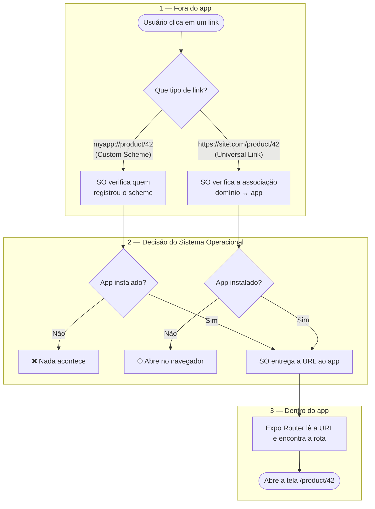
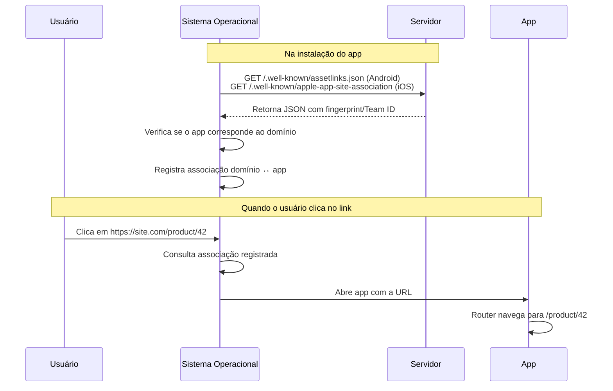
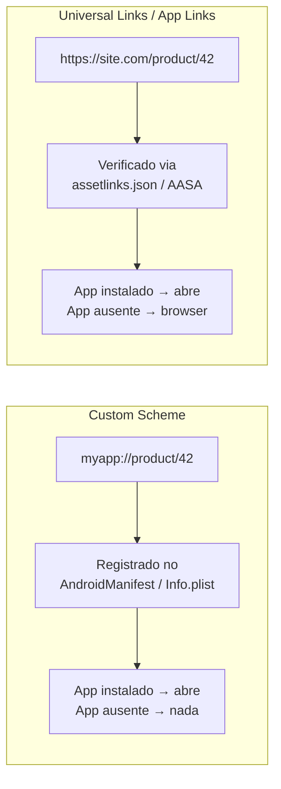
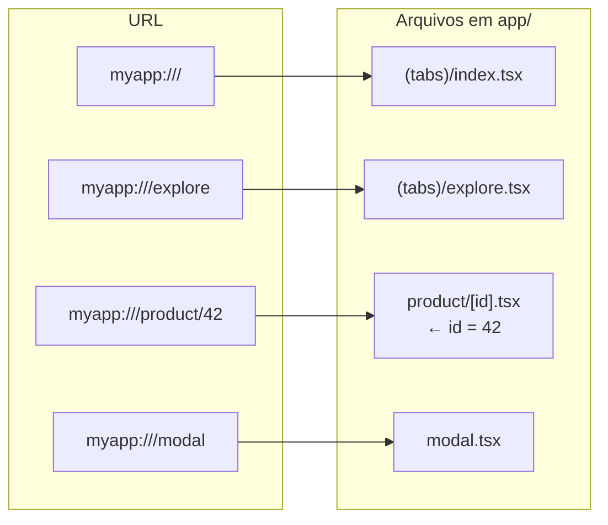

# Deep Linking — Estudo e POC

Projeto de estudo sobre Deep Linking em React Native com Expo Router.

---

## O que é Deep Linking?

Deep Linking é a capacidade de abrir um app mobile em uma tela específica a partir de uma URL externa — seja por outro app, notificação, e-mail, SMS ou browser.

---

## Arquitetura Geral

O deep linking acontece em **3 fases**: o link é disparado fora do app, o sistema operacional decide o que fazer com ele, e por fim o app abre a tela certa.



> **Por que duas verificações diferentes na fase 2?** O *custom scheme* (`myapp://`) só checa qual app registrou aquele nome — por isso é frágil (qualquer app pode registrar). Já o *universal link* (`https://`) exige que o domínio comprove ser dono do app, e por isso consegue cair no navegador como fallback quando o app não está instalado.

---

## Fluxo de Verificação — Universal Links



---

## Custom Scheme vs Universal Links



---

## Expo Router — Mapeamento de URLs



---

## Tipos de Deep Link

### 1. Custom URL Scheme

```
myapp://product/42
```

- Simples de configurar
- Funciona sem domínio próprio
- Não abre no browser se o app não estiver instalado
- **Problema:** qualquer app pode registrar o mesmo scheme — sem garantia de exclusividade

### 2. Universal Links (iOS) / App Links (Android)

```
https://meudomain.com/product/42
```

- Usa HTTPS — exclusivo para quem controla o domínio
- Abre o app se instalado, senão cai no browser (fallback automático)
- Requer arquivo de verificação hospedado no servidor
- Mais seguro e recomendado para produção

---

## Configuração — Custom URL Scheme

### Expo (`app.json`)

```json
{
  "expo": {
    "scheme": "myapp",
    "android": {
      "intentFilters": [
        {
          "action": "VIEW",
          "data": [{ "scheme": "myapp" }],
          "category": ["BROWSABLE", "DEFAULT"]
        }
      ]
    },
    "ios": {
      "bundleIdentifier": "com.empresa.app"
    }
  }
}
```

O Expo Config Plugin gera automaticamente os arquivos nativos a partir dessa configuração durante o build.

### React Native puro — Android

Edite `android/app/src/main/AndroidManifest.xml` e adicione um `<intent-filter>` dentro da `<activity>`:

```xml
<activity android:name=".MainActivity" ...>

  <!-- intent-filter existente para abrir o app -->
  <intent-filter>
    <action android:name="android.intent.action.MAIN" />
    <category android:name="android.intent.category.LAUNCHER" />
  </intent-filter>

  <!-- intent-filter para custom scheme -->
  <intent-filter>
    <action android:name="android.intent.action.VIEW" />
    <category android:name="android.intent.category.DEFAULT" />
    <category android:name="android.intent.category.BROWSABLE" />
    <data android:scheme="myapp" />
  </intent-filter>

</activity>
```

### React Native puro — iOS

Edite `ios/[NomeDoApp]/Info.plist` e adicione:

```xml
<key>CFBundleURLTypes</key>
<array>
  <dict>
    <key>CFBundleURLName</key>
    <string>com.empresa.app</string>
    <key>CFBundleURLSchemes</key>
    <array>
      <string>myapp</string>
    </array>
  </dict>
</array>
```

---

## Configuração — Universal Links (iOS) / App Links (Android)

### Passo 1 — Arquivo no servidor

**Android** — hospede em `https://meudomain.com/.well-known/assetlinks.json`:

```json
[{
  "relation": ["delegate_permission/common.handle_all_urls"],
  "target": {
    "namespace": "android_app",
    "package_name": "com.empresa.app",
    "sha256_cert_fingerprints": ["AA:BB:CC:..."]
  }
}]
```

> O `sha256_cert_fingerprints` é obtido com:
> ```bash
> keytool -list -v -keystore release.keystore
> ```

**iOS** — hospede em `https://meudomain.com/.well-known/apple-app-site-association`:

```json
{
  "applinks": {
    "apps": [],
    "details": [{
      "appID": "TEAMID.com.empresa.app",
      "paths": ["/product/*", "/modal"]
    }]
  }
}
```

> O arquivo deve ser servido com `Content-Type: application/json` e sem redirecionamentos.

### Passo 2 — Configuração no app

**Expo (`app.json`):**

```json
{
  "expo": {
    "android": {
      "intentFilters": [
        {
          "action": "VIEW",
          "autoVerify": true,
          "data": [
            {
              "scheme": "https",
              "host": "meudomain.com",
              "pathPrefix": "/product"
            }
          ],
          "category": ["BROWSABLE", "DEFAULT"]
        }
      ]
    },
    "ios": {
      "associatedDomains": ["applinks:meudomain.com"]
    }
  }
}
```

**React Native puro — Android (`AndroidManifest.xml`):**

```xml
<intent-filter android:autoVerify="true">
  <action android:name="android.intent.action.VIEW" />
  <category android:name="android.intent.category.DEFAULT" />
  <category android:name="android.intent.category.BROWSABLE" />
  <data android:scheme="https" android:host="meudomain.com" android:pathPrefix="/product" />
</intent-filter>
```

**React Native puro — iOS (`Entitlements.plist`):**

```xml
<key>com.apple.developer.associated-domains</key>
<array>
  <string>applinks:meudomain.com</string>
</array>
```

---

## Roteamento com Expo Router

Com Expo Router, **não existe arquivo central de rotas**. O mapeamento é automático pela estrutura de arquivos:

```
app/
  _layout.tsx           → layout raiz
  (tabs)/
    index.tsx           → myapp:///
    explore.tsx         → myapp:///explore
  product/
    [id].tsx            → myapp:///product/:id
  modal.tsx             → myapp:///modal
```

### Parâmetros dinâmicos

```tsx
// app/product/[id].tsx
import { useLocalSearchParams } from 'expo-router';

export default function ProductScreen() {
  const { id } = useLocalSearchParams();
  return <Text>Produto: {id}</Text>;
}
```

### Roteamento com React Navigation (sem Expo Router)

```tsx
import { NavigationContainer } from '@react-navigation/native';
import * as Linking from 'expo-linking';

const linking = {
  prefixes: [Linking.createURL('/'), 'https://meudomain.com'],
  config: {
    screens: {
      Home: '',
      Product: 'product/:id',
      Modal: 'modal',
    },
  },
};

export default function App() {
  return (
    <NavigationContainer linking={linking}>
      {/* ... */}
    </NavigationContainer>
  );
}
```

---

## Receber links no app

### App estava fechada (cold start)

```tsx
import * as Linking from 'expo-linking';

const url = await Linking.getInitialURL();
if (url) {
  // processar e navegar
}
```

### App estava em background (warm start)

```tsx
useEffect(() => {
  const subscription = Linking.addEventListener('url', ({ url }) => {
    // processar e navegar
  });
  return () => subscription.remove();
}, []);
```

> Com Expo Router isso é tratado automaticamente — o router intercepta a URL e navega para a rota correspondente sem código extra.

---

## Expo Go vs Development Build

| | Expo Go | Development Build |
|---|---|---|
| Custom scheme (`myapp://`) | Não funciona | Funciona |
| Universal Links / App Links | Não funciona | Funciona |
| Navegação interna (`router.push`) | Funciona | Funciona |
| Ideal para | Prototipagem rápida | Testar deep links reais |

Para buildar o development build localmente:

```bash
# Requer Android Studio / Xcode instalados
npm run android   # builda e instala no emulador/dispositivo
npm run ios
```

Para buildar na nuvem via EAS (sem precisar do Android Studio):

```bash
npx eas build --profile development --platform android
```

---

## Testando Deep Links

### Via terminal

```bash
# Android — emulador ou dispositivo via USB
adb shell am start -W -a android.intent.action.VIEW -d "myapp:///product/42"

# iOS — simulador
xcrun simctl openurl booted "myapp:///product/42"
```

### Via Expo CLI

```bash
npx uri-scheme open "myapp:///product/42" --android
npx uri-scheme open "myapp:///product/42" --ios
```

### No próprio app

```tsx
import { Linking } from 'react-native';

<Button
  title="Testar deeplink"
  onPress={() => Linking.openURL('myapp:///product/42')}
/>
```

### Configurar adb no PATH (macOS)

```bash
# Adicione no ~/.zshrc
export ANDROID_HOME=$HOME/Library/Android/sdk
export PATH=$PATH:$ANDROID_HOME/platform-tools
```

---

## Arquivos nativos gerados pelo Expo

O Expo lê o `app.json` e gera os arquivos nativos automaticamente durante o build:

| Configuração | Arquivo gerado |
|---|---|
| `scheme` + `intentFilters` (Android) | `android/app/src/main/AndroidManifest.xml` |
| `scheme` (iOS) | `ios/[App]/Info.plist` |
| `associatedDomains` (iOS) | `ios/[App]/[App].entitlements` |

Em projetos React Native puro (sem Expo), esses arquivos são editados manualmente.

---

## Edge Cases importantes

- **App não instalada:** o link não abre com custom scheme — use Universal/App Links para ter fallback no browser
- **Link chega antes da navegação estar pronta:** enfileire a URL e processe após o mount do navigator
- **Autenticação:** redirecione para o login guardando o destino original, e após autenticar navegue para ele
- **Android — `autoVerify`:** sem `autoVerify: true` no intent filter, o Android trata o link como custom scheme e exibe o seletor de apps
- **iOS — HTTPS obrigatório:** o arquivo `apple-app-site-association` deve estar em HTTPS sem redirecionamentos

---

## Estrutura deste projeto

```
app/
  (tabs)/
    index.tsx         — home com botões de teste de deeplink
    explore.tsx       — aba explorar
  product/
    [id].tsx          — tela de produto, recebe ID via URL
  modal.tsx           — modal acessível via deeplink
  _layout.tsx         — layout raiz com Stack navigator
android/
  app/src/main/
    AndroidManifest.xml  — intent-filters gerados pelo Expo build
app.json              — scheme e intentFilters configurados
```